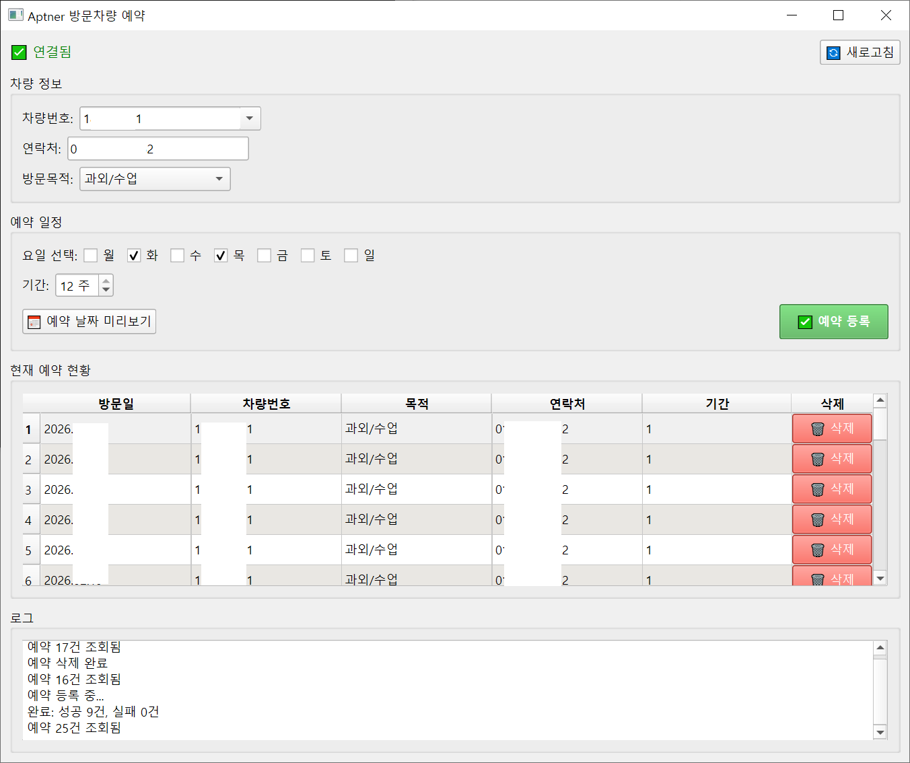

# Aptner Bulk Reserver (아파트너 방문차량 일괄 예약 도구)

아파트너(Aptner) 앱의 방문차량 일괄 예약을 쉽게 할 수 있는 GUI 도구입니다.

> ⚠️ **면책 조항 (Disclaimer)**
> 
> 이 도구는 개인적인 용도로 만들어진 **비공식 도구**입니다.
> - 아파트너(주식회사 두꺼비세상)와 어떠한 제휴나 보증 관계도 없습니다.
> - 사용으로 인한 모든 책임은 사용자 본인에게 있습니다.
> - API 변경 등으로 언제든지 작동이 중단될 수 있습니다.
> - **Use at your own risk.**

## 스크린샷



## 기능

- 🚗 **차량번호 저장**: 이전에 사용한 차량번호와 연락처를 자동 저장
- 📅 **반복 예약**: 요일 선택 + 주 단위로 일괄 예약 (예: 매주 화/목)
- 📋 **예약 현황**: 현재 예약된 목록을 테이블로 표시
- 🗑️ **예약 삭제**: 개별 예약 삭제 가능
- ⚡ **중복 방지**: 이미 예약된 날짜는 자동으로 건너뜀

---

## 설치 방법

### 방법 1: Windows 초보자용 (권장)

#### 1단계: Python 설치

1. [python.org/downloads](https://www.python.org/downloads/) 에서 Python 다운로드
2. 설치 시 **"Add Python to PATH"** 체크박스를 반드시 선택!
3. "Install Now" 클릭하여 설치 완료

#### 2단계: 파일 다운로드

1. 이 페이지 상단의 녹색 **"Code"** 버튼 클릭
2. **"Download ZIP"** 클릭
3. 다운로드된 ZIP 파일을 원하는 폴더에 압축 해제

#### 3단계: 필수 라이브러리 설치

1. 압축 해제한 폴더를 열기
2. 주소창을 클릭하고 `cmd`를 입력 후 Enter (명령 프롬프트 열림)
3. 다음 명령어 입력 후 Enter:
   ```
   pip install -r requirements.txt
   ```
4. 설치가 완료될 때까지 대기

#### 4단계: 계정 설정

1. `.env.example` 파일을 `.env`로 이름 변경
2. `.env` 파일을 메모장으로 열기
3. 아파트너 ID와 비밀번호 입력:
   ```
   APTNER_ID=여기에_아이디_입력
   APTNER_PW=여기에_비밀번호_입력
   ```
4. 저장 후 닫기

#### 5단계: 실행

**`aptner.bat`** 파일을 더블클릭하면 프로그램이 실행됩니다!

---

### 방법 2: 개발자용 (Git 사용)

```bash
# 저장소 클론
git clone https://github.com/mahlernim/aptner-bulk-reserver.git
cd aptner-bulk-reserver

# 의존성 설치
pip install -r requirements.txt

# 환경 설정
cp .env.example .env
# .env 파일을 열어 계정 정보 입력

# 실행
python aptner_gui.py
```

---

## 사용법

1. 차량번호 입력 (이전 기록이 있으면 드롭다운에서 선택)
2. 연락처 입력
3. 방문 목적 선택
4. 요일 체크 (예: 화, 목)
5. 기간 설정 (예: 4주)
6. "예약 날짜 미리보기" 클릭하여 확인
7. "예약 등록" 클릭

## 파일 구조

```
aptner-bulk-reserver/
├── aptner_gui.py      # PyQt6 GUI 메인
├── aptner_api.py      # API 클라이언트
├── aptner.bat         # Windows 실행 스크립트
├── requirements.txt   # 의존성 목록
├── .env.example       # 환경변수 예시
├── .env               # 실제 환경변수 (git에 포함 안됨)
└── car_history.yaml   # 저장된 차량 기록 (git에 포함 안됨)
```

## API 정보

이 도구는 아파트너 v2 API를 사용합니다:

| 엔드포인트 | 메서드 | 설명 |
|-----------|--------|------|
| `/auth/token` | POST | 로그인 |
| `/pc/reserves` | GET | 예약 목록 조회 |
| `/pc/reserve/` | POST | 예약 등록 |
| `/pc/reserve/{id}` | DELETE | 예약 삭제 |

## 참고

- API 구현은 [af950833/aptner](https://github.com/af950833/aptner) Home Assistant 컴포넌트를 참고했습니다. (af님 감사합니다!)

## 작성자

[@mahlernim](https://github.com/mahlernim)

## 라이선스

MIT License
